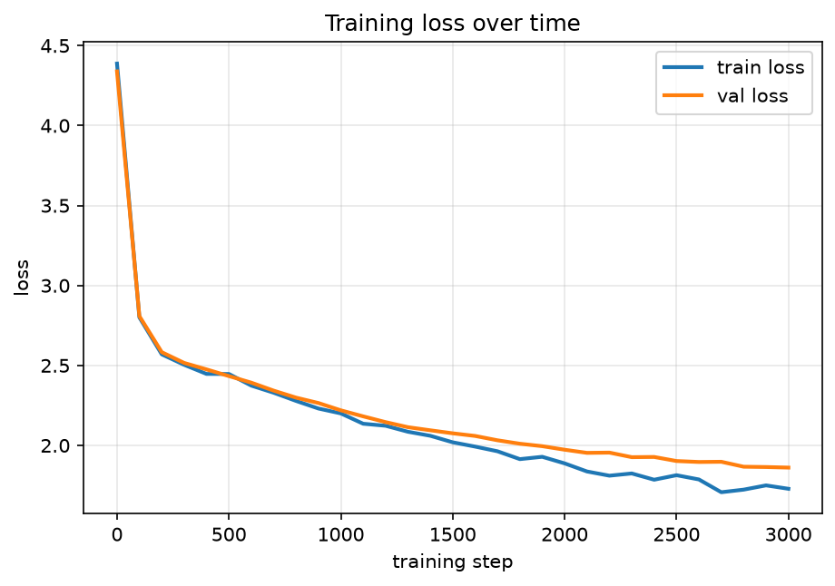

# Training Dynamics Visualizer

**[Try the live demo](https://training-dynamics-viz.streamlit.app/)** — scrub through training and watch a language model learn, no setup required.

Watch a language model learn — checkpoint by checkpoint, from random noise
to coherent-ish Shakespeare.

Most ML projects show you a model's *final* result. This one instruments
the *process*: a character-level GPT is trained from scratch on Tiny
Shakespeare, saving a checkpoint every 100 steps, so you can scrub through
training like a flipbook and watch its internals actually change — the
text it generates, how its token embeddings organize themselves in space,
and how its attention patterns evolve.

Built entirely from scratch in PyTorch (nanoGPT-style, no HuggingFace) so
every activation is inspectable.

## Why this project

Training dynamics — *how* a model changes during training, not just what
it ends up knowing — is an under-visualized part of deep learning. Most
people (including practitioners) have an intuition that "the model
gradually gets better," but rarely see it happen at the level of individual
neurons, embeddings, or attention heads. This project makes that process
literally scrubbable.

## What's in this repo

```
src/
  model.py       # from-scratch character-level GPT (causal self-attention, MLP, LayerNorm)
  data.py        # character tokenizer + batching for Tiny Shakespeare
  train.py        # training loop, checkpointing every N steps
  analysis.py     # checkpoint loading, PCA embedding projection, attention extraction, generation
app.py            # Streamlit flipbook — scrub through training interactively
make_figures.py   # renders static loss curve + embedding evolution + text samples for the README
tests/test_model.py
data/tinyshakespeare.txt   # the classic char-rnn/nanoGPT dataset
checkpoints/               # saved model checkpoints + metrics.csv (populated by train.py)
figures/                   # generated plots
```

## See it working (2 minutes)

```bash
git clone https://github.com/VershitaX/training-dynamics-viz.git
cd training-dynamics-viz
python3 -m venv .venv && source .venv/Scripts/activate   # Scripts/ on Windows, bin/ on Mac/Linux
pip install -r requirements.txt

python src/train.py --quick     # ~1 minute, produces a handful of checkpoints
streamlit run app.py             # opens the interactive flipbook in your browser
```

Drag the step slider and watch the generated text, embedding scatter plot,
and attention pattern all update live.

For the real result — genuinely coherent-looking pseudo-Shakespeare and
much clearer embedding structure — run the full training:

```bash
python src/train.py             # ~20-25 minutes on CPU, ~3000 steps
python make_figures.py           # renders static figures for the README
streamlit run app.py
```

## Run the tests

```bash
pytest tests/ -v
```

## What you'll actually see happen during training

- **Step 0**: generated text is pure noise — random characters, no structure.
- **Early steps (~50-300)**: the model discovers basic statistics — common
  letter frequencies, short recognizable fragments, roughly English-shaped
  "words" that aren't real words yet.
- **Mid training (~500-1500)**: character names, stage-direction formatting
  (`ROMEO:`), and punctuation patterns start appearing reliably.
- **Later (~2000-3000)**: noticeably more coherent structure — sentence-like
  rhythm, consistent capitalization after periods, dialogue formatting.

The embedding PCA plot tells the same story spatially: early on, all 65
characters are scattered with no meaningful arrangement. As training
progresses, you'll typically see vowels cluster together, punctuation
separate from letters, and uppercase/lowercase pairs drift toward each
other — the model discovering structure in its input alphabet purely from
next-character prediction, with no explicit linguistic supervision.

## Results

Running the full training (3000 steps, 3-layer model, ~21 minutes on CPU)
produces a clean, healthy training curve:



Loss drops sharply in the first ~200 steps, then decays smoothly, with
train and validation loss tracking closely throughout — only a small,
expected gap opens up late in training (train 1.73 vs. val 1.86 at step
3000), showing no serious overfitting at this scale.

The more immediately convincing evidence is what the model actually
writes at different points in training. Prompted with `ROMEO:` at
increasing checkpoints:

```
=== step 1600 ===
ROMEO:
Why mhis the henle made a mearty wound gelsters,
I ware govint beare hath thin beie sofe.

Shichsed though rew aper and stidy theer non my fatter wel

=== step 2200 ===
ROMEO:
Why mhous haveself if of mye hand, in I to the my
pour you for beere hath good beiels!
Thee him stanter your we pereace:
What thour not my fatter wel

=== step 2800 ===
ROMEO:
Why more know sell it of yoes, you dake to the and
Aut you foreaker channow to be evices. I have that of
pery to we a commidy thour nonemit to of wel
```

None of these are real words — this is a tiny, short-duration model, not
a production language model — but the structure the model discovers
purely from next-character prediction is genuinely striking: consistent
`NAME:` formatting matching the play's dialogue structure, correct
capitalization after line breaks, plausible English letter combinations
and syllable patterns, and stable line-length rhythm resembling verse.
None of this was explicitly labeled during training; it's all inferred
from character sequences alone.

The embedding-space PCA plot (`figures/embedding_evolution.png`) is
included for completeness, but is honestly the weakest piece of evidence
at this scale — with only 96 embedding dimensions projected down to 2,
visible clustering is subtle to the eye in a static image. The loss curve
and generated text samples above are the clearer signal that real
structure is being learned.

## Interactive demo

A live version (no setup required) is available at:
**[https://training-dynamics-viz.streamlit.app/](https://training-dynamics-viz.streamlit.app/)**

If no checkpoint exists yet when the app loads, it will show an error
asking you to run training first — this app does not auto-train a fallback
(training a useful language model, even a tiny one, takes meaningfully
longer than the toy arithmetic case, so a live on-the-fly fallback isn't
practical here).

## Design notes

- **Character-level, not BPE**: keeps the vocabulary small (65 characters)
  and every token human-readable, so the embedding-space visualization can
  label each point with the literal character it represents.
- **Checkpoint size is deliberately kept small** (~1-2MB each with default
  settings) specifically so the full checkpoint history can be committed to
  git and used directly by a deployed demo, rather than requiring
  users to retrain locally.
- **Dropout is off by default** since this is a small-scale, short-duration
  training run where overfitting isn't the primary concern — the point is
  to observe learning dynamics, not to produce a production-quality model.

## Roadmap

- [x] From-scratch char-GPT + checkpointed training loop
- [x] PCA embedding-space visualization across training
- [x] Attention pattern extraction and visualization
- [x] Interactive Streamlit flipbook
- [ ] Probing classifiers tracking *when* specific capabilities emerge
      (e.g. step at which the model reliably closes quotes, capitalizes
      after periods, or completes character names)
- [ ] Side-by-side comparison mode: two training runs (e.g. different
      learning rates) scrubbed in sync
- [ ] Export the flipbook as an animated GIF/video for easy sharing

## Background reading

- Karpathy — [Let's build GPT: from scratch, in code, spelled out](https://www.youtube.com/watch?v=kCc8FmEb1nY) (nanoGPT reference)
- Olsson et al. — [In-context Learning and Induction Heads](https://transformer-circuits.pub/2022/in-context-learning-and-induction-heads/index.html)
- Elhage et al. — [A Mathematical Framework for Transformer Circuits](https://transformer-circuits.pub/2021/framework/index.html)

## License

MIT — see [LICENSE](LICENSE).
